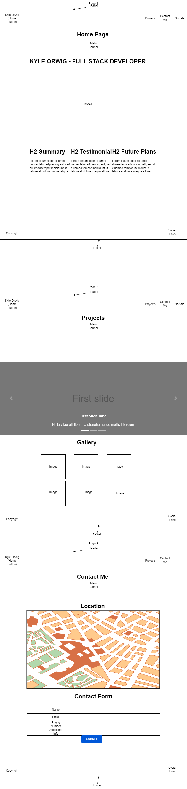

# Overview

- To show skills learned in .html and .css to create a custom webpage. I decided to make a website for myself and showcases testemonials, a summary of projects, and a contact me page to request information.

Functionality

- HTML pages linked in navbar menu

Wireframes

Technology Used

- HTML , CSS

Improvements

- Enhancements for different screen sizes
- More interactive features on landing page
- Footer needs some work, unsure how to get the text elements where I want them

Hosted at:

- Hosting Link: [https://kaywig15.github.io/Project1/index.html]
- GitHub: [https://github.com/kaywig15/Project1]

User stories:

- As a person in need of a website, I can know how to contact a designer in their contact me page
- As a site visitor, I can see what projects this person has been working on on the projects tab
- As a visitor, I can gain a better understanding of the person that this webpage is about
